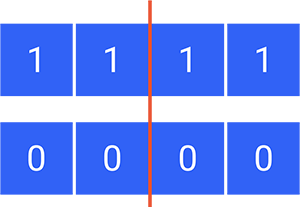

Gli algoritmi genetici sono la tipologia di [algoritmi evolutivi](https://marcocianetti.com/introduzione-algoritmi-evolutivi) più famosa, tant’è che spesso i due termini vengono confusi, un po’ come accade tra **Intelligenza Artificiale** e **Machine Learning**.

In realtà gli algoritmi genetici sono degli algoritmi evolutivi dove la rappresentazione degli individui è una stringa (spesso con valori binari).

In questo articolo ti farò una panoramica sugli algoritmi genetici e **te ne mostrerò uno in azione** per risolvere un semplice problema.

> **TL;DR**  
> Vuoi vedere subito l'esempio? [Clicca qui](#esempio)

## Introduzione

Gli **algoritmi genetici** (GA, da Genetic Algorithms) sono strumenti di intelligenza artificiale ispirati alla teoria dell‘evoluzione di Darwin: la selezione naturale, l’adattamento e la teoria della sopravvivenza vengono utilizzati da questi strumenti per risolvere **problemi di ottimizzazione** computazionalmente difficili.

L’idea che sta alla base degli algoritmi genetici è quella di selezionare le soluzioni migliori e di ricombinarle in qualche modo fra loro in maniera tale che esse evolvano verso un punto di ottimo.

Come già accennato, gli algoritmi genetici fanno parte di una categoria più grande, quella degli **algoritmi evolutivi**, e gran parte delle nozioni le puoi trovare anche nell’[articolo ad essi dedicato](https://marcocianetti.com/introduzione-algoritmi-evolutivi).

Ciò che distingue i GA dalle altre tipologie di algoritmi evolutivi è la struttura degli individui: qui ogni individuo è una **stringa di caratteri** e,  molto spesso, ogni carattere può assumere un **valore binario**.

Iniziamo con un piccolo riassunto delle nozioni principali degli algoritmi evolutivi, necessarie per comprendere gli algoritmi genetici.

## Nozioni principali degli algoritmi evolutivi

### Selezione naturale

In natura, il processo di selezione naturale inizia con la selezione degli individui che hanno la maggior probabilità di sopravvivere (che hanno maggior *”fitness”* con l’ambiente circostante).

Questi individui si riproducono dando vita a nuovi individui che ereditano le caratteristiche dei genitori e ne sviluppano delle proprie. Se i genitori avevano una buona probabilità di sopravvivere allora anche i figli (probabilmente) l’avranno.

Questo tipo di processo può essere applicato anche nei problemi di ricerca. Cerchiamo le soluzioni migliori, le utilizziamo per generarne di nuove e le modifichiamo. Ripetiamo questi step fino a che non ne troviamo una che ci soddisfi.

## Le fasi di un algoritmo evolutivo

Possiamo distinguere 5 fasi in un algoritmo evolutivo:

* Popolazione iniziale
* Funzione di fitness
* Selezione
* Crossover
* Mutazione

### Popolazione iniziale

Il processo inizia con un insieme di individui chiamato **popolazione iniziale**. Ogni individuo della popolazione rappresenta una **soluzione** al problema che si vuole risolvere.

Un individuo è caratterizzato da un insieme di parametri detti **geni**.  L’insieme di questi geni forma un **cromosoma** (la soluzione).

### Funzione di fitness

La funzione di fitness determina l’abilità di un individuo di competere con gli altri e di sopravvivere nell’ambiente circostante.

Essa assegna un punteggio ad ogni individuo e la probabilità che un individuo venga selezionato per la riproduzione è basata su questo punteggio.

### Selezione

L’idea della fase di selezione è quella di selezionare gli individui con il punteggio di fitness maggiore e permettergli di tramandare i propri geni alla generazione successiva.

### Crossover

Il crossover è la fase più importante per un algoritmo evolutivo. Per ogni coppia di genitori selezionati viene scelto casualmente un **punto di crossover** tra i loro geni.

I figli sono creati scambiando i geni tra i due genitori fino al raggiungimento del punto di crossover.

Gli individui appena creati vengono aggiunti alla popolazione che definirà la **nuova generazione**.

### Mutazione

In alcuni individui è possibile che uno o più dei loro geni subisca una **mutazione** (la probabilità che un individuo muti è spesso molto bassa).

La mutazione è necessaria per mantenere la diversità all’interno della popolazione e **prevenire una convergenza prematura**.

### Terminazione

L’algoritmo termina quando la popolazione ha raggiunto una convergenza ovvero non produce nuovi individui che sono significativamente diversi da quelli precedenti.

In questo caso si dice che l’algoritmo ha prodotto un insieme di soluzioni per il problema.

Altre condizioni di terminazione dell’algoritmo sono ad esempio il *tempo trascorso* o il *numero di generazioni* che sono state create.

## Il problema che andremo a risolvere

Definiamo il problema che risolveremo utilizzando il nostro algoritmo genetico.

Ti ricordo che per applicare un algoritmo genetico (o in generale un algoritmo evolutivo) abbiamo bisogno di:

* Un problema;
* La forma di una soluzione al problema (geni e cromosoma);
* Una funzione che ci indichi quanto è *buona* una soluzione (funzione di fitness).

Oltre, ovviamente, ai parametri che utilizzeremo per il nostro algoritmo genetico.

### Problema

Ogni buon informatico muove il primo passo verso una nuova tecnologia con un “Hello World!” e noi non saremo da meno.

Il nostro algoritmo genetico avrà come scopo quello di scrivere “Hello World!”.

Bene, ora che abbiamo il nostro problema possiamo passare agli altri elementi fondamentali che ci servono per eseguire il nostro algoritmo:

* La struttura della soluzione;
* La funzione di fitness.

### Soluzione

Le soluzioni al problema hanno una forma molto semplice: sono delle stringhe di caratteri dell’alfabeto, con lunghezza 12.

Il nostro individuo (cromosoma) sarà quindi una stringa di lunghezza 12 che ammette caratteri (geni) *a-Z* e i *caratteri speciali*.

### Funzione di fitness

Per valutare la bontà di una soluzione abbiamo alcune possibilità tra cui scegliere.

La prima è la più semplice che assegna alla soluzione **un punto per ogni carattere corretto posto nella giusta posizione** nella stringa.

Più è alto il punteggio è più l’individuo rappresenta una buona soluzione.

> **Esempio**  
> “Helfo wOdrlZ” ottiene 5 punti  
> H + e + l + o + *spazio* = 5 punti  

La seconda assegna un punto per ogni carattere corretto, anche se in posizione diversa, e due punti per ogni carattere corretto nella posizione giusta.

> **Esempio**  
> “Helfo wOdrlZ” ottiene 13 punti  
> H (2) + e (2) + l (2) + o (2) + *spazio* (2) + d (1) + r (1) + l (1) = 13 punti  

Un’altra ancora potrebbe essere una funzione che per ogni carattere assegna:

* Se il carattere è corretto -> 1 punto;
* Se il carattere è sbagliato -> Un valore relativo alla *”distanza”* tra il carattere sbagliato e quello corretto.

Ci sono altre possibilità, come ad esempio quella della distanza di Lehinstein, ma per ora soffermiamoci su queste tre.

#### Quale funzione di fitness scegliere

La scelta della funzione di fitness è molto importante ed è anche dipendente dagli altri parametri dell’algoritmo, come la modalità di crossover e la mutazione.

Ti faccio subito un esempio.

Supponiamo che la mutazione di un individuo avvenga in questo modo: viene scelto un carattere a caso e viene sostituito con il carattere successivo o precedente dell’alfabeto. 

> **Esempio**  
> Il carattere “f” può diventare “e” oppure “g”.  

In questo caso sarebbe molto meglio che i nostri individui, oltre ad avere i caratteri corretti nelle giuste posizioni, avessero i caratteri diversi *“vicini”* a quelli corretti, dunque utilizzare la 3° funzione di fitness che abbiamo descritto sarebbe un’ottima idea.

Un altro esempio, stavolta riguardo il crossover.

Supponiamo che il crossover tra due individui avvenga in questo modo: vengono scelti *n* indici a caso e i blocchi tra i due genitori vengano *“scambiati”* per generare i due nuovi individui.

In questo caso sarebbe utile che i nostri individui abbiano molti caratteri giusti, anche se in posizioni diverse, perché poi il crossover potrebbe  generare degli individui con i caratteri posizionati correttamente.

Tornando al nostro algoritmo e alla funzione di fitness direi che possiamo utilizzare la **prima**, quella che fa riferimento solo ai caratteri corretti nelle posizioni giuste. Questo perché le altre funzioni non ci aiuterebbero molto di più in base alle funzioni di mutazione e crossover che utilizzeremo.

Bene, ora abbiamo trovato tutti gli ingredienti per il nostro algoritmo genetico.

Mancano solo alcuni dettagli, definiamoli così da poter iniziare con la parte divertente.

## Parametri

I dettagli da definire non sono poi così *“dettagli”* perché avranno una grande influenza sul nostro algoritmo.

* Numero di individui nella popolazione;
* Modalità di crossover;
* Modalità di mutazione;
* Condizione di terminazione.

**Numero di individui nella popolazione**  
Il numero di individui nella popolazione indica quante soluzioni per ogni iterazione dell’algoritmo: più ne abbiamo e più velocemente possiamo trovare quella che ci soddisfi.

> **Nota**  
> Un numero di individui troppo alto potrebbe portare ad un rallentamento delle prestazioni, quindi meglio non esagerare.  

Per un problema così semplice anche una popolazione molto ristretta può andar bene, possiamo partire anche con **25 individui**.

**Modalità di crossover**  
Il crossover verrà implementato nel seguente modo:

* utilizzeremo un solo punto di crossover;
* il punto di crossover sarà scelto a caso ogni volta;
* Il primo degli individui generati avrà i geni del primo genitore fino al punto di crossover, poi quelli del secondo;
* Il secondo degli individui generati avrà i geni del secondo genitore fino al punto di crossover, poi quelli del primo.

**Modalità di mutazione**  
La mutazione che verrà utilizzata è piuttosto semplice:

* viene scelto un carattere a caso dell’individuo che deve mutare;
* il carattere viene sostituito con uno a caso preso dall’alfabeto.

E come probabilità di mutazione di un individuo inizierei con una alta probabilità, direi **0.3**.

**Condizione di terminazione**  
L’algoritmo terminerà **quando avrà trovato la soluzione** oppure quando avrà **superato le 5000 generazioni**.

Ottimo, ora abbiamo davvero tutto, possiamo passare al tuo **primo algoritmo genetico**!

## Esempio

Siamo finalmente giunti alla parte divertente, vedere il nostro algoritmo genetico in azione.

Ho realizzato una pagina sul [mio GitHub Pages](https://marcocianetti.github.io) in cui è possibile testare questo algoritmo con l'ausilio di [questa libreria](https://github.com/subprotocol/genetic-js) JavaScript per l'implementazione dell'algoritmo genetico.

Facciamo un piccolo recap prima di partire:

* **Problema**: vogliamo ottenere la scritta “Hello World” con un algoritmo genetico;
* **Soluzione**: la soluzione del nostro problema è la stringa “Hello World”;
* **Funzione di fitness**: una possibile soluzione guadagna punti quando ha un carattere corretto nella giusta posizione;
* **Crossover**: utilizzeremo un semplice crossover con un punto;
* **Mutazione**: un carattere dell’individuo verrà sostituito casualmente con un altro dall’alfabeto e la probabilità di mutazione sarà di 0.3;
* **Popolazione**: la popolazione sarà di 100 individui.

Bene, sei pronto a lanciare il tuo primo algoritmo genetico?

Ti basta andare su [questa pagina](https://marcocianetti.github.io/tutorial/scrivere-hello-world-con-algoritmi-genetici.html "Scrivere \"Hello World\" con gli algoritmi genetici | Marco Cianetti") e cliccare sul tasto “Avvia”.

Qui puoi vedere i risultati di una mia esecuzione, dove con 253 generazioni l'algoritmo ha trovato la soluzione:

