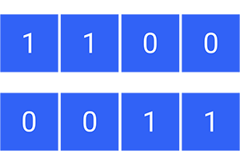
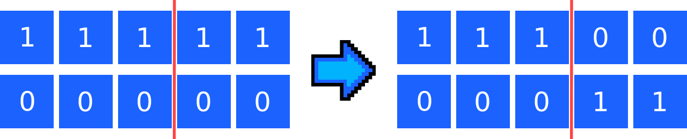
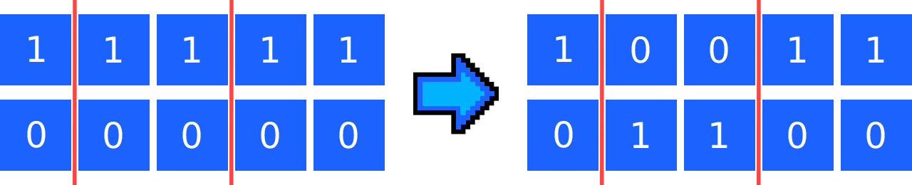
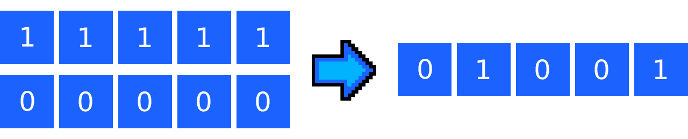

## Introduzione

Il crossover negli [algoritmi evolutivi](/articoli/introduzione-algoritmi-evolutivi) è un processo chiave che aiuta a generare nuove soluzioni e migliorare le soluzioni esistenti. Il crossover consiste nel *"mixare"* due soluzioni per crearne una nuova che combini le caratteristiche di entrambe.
Spesso le nuove soluzioni vengono [mutate](/articoli/mutazione-algoritmi-evolutivi) prima di essere aggiunte alla **nuova generazione**.

Questo processo è fondamentale in quanto permette di evitare il "blocco evolutivo" e di creare soluzioni sempre più efficienti e ottimali. In questo articolo esploreremo in dettaglio cos'è il crossover negli algoritmi evolutivi, come funziona e perché è così importante.

## Cos'è il crossover

Il termine *"crossover"* deriva dall'analogia con la procreazione biologica in cui i geni dei genitori vengono combinati per creare un nuovo individuo. Allo stesso modo, nel crossover dell'algoritmo evolutivo, le soluzioni vengono combinate per crearne una nuova.

Esistono diversi metodi di crossover, ognuno dei quali permette di generare soluzioni diverse. Ad esempio, il **crossover uniforme** consiste nel prendere ogni bit per la nuova soluzione da uno dei due genitori con probabilità equa (anche se ci sono alcune varianti che utilizzano probabilità diverse). Il crossover a **un punto** (o meglio **one-point crossover**), invece,  consiste nello scegliere un punto di divisione casuale e combinare i segmenti da entrambe le soluzioni.

Per rendere tutto più chiaro ti mostro subito **un esempio**.

### Esempio di one-point crossover

Supponiamo di avere dei genomi formati da 4 geni, ognuno
dei quali può assumere un valore binario.

Il primo dei due genitori è costituito da soli 1 e il secondo da soli 0.
Il **punto di crossover** selezionato (indicato con una linea arancione) corrisponde alla metà del genoma.


I nuovi individui saranno quindi composti come segue:

- Il primo **tutti i geni del primo genitore** fino al punto di crossover, **poi tutti i geni del secondo**;
- Il secondo avrà **tutti i geni del secondo genitore** fino al punto di crossover, **poi tutti i geni del primo**.

Ecco il risultato:



## Tipologie di crossover

Come ti anticipavo, ci sono vari tipi di crossover che permettono di generare nuovi individui a partire da altri.

Tra i più famosi e utilizzati troviamo il **one-point crossover**, il **two-points crossover** (o il generico **k-points crossover**) e il **crossover uniforme**.

Vediamo come funzionano.

### One-point crossover

- Seleziona un punto casuali, chiamato **punto di crossover**;
- Genera una soluzione che abbia i primi *N* geni (fino al punto di crossover) del primo genitore, e i restanti del secondo genitore;
- Genera una soluzione che abbia i primi *N* geni (fino al punto di crossover) del secondo genitore, e i restanti del primo genitore.



#### Esempio di implementazione in JavaScript

```javascript

// I due genitori sono 2 stringhe
function onePointCrossover(parent1, parent2) {

  // Crea il punto di crossover casuale
  const crossoverPoint = Math.floor(Math.random() * (parent1.length - 1)) + 1;
  
  // Crea i due nuovi figli
  const child1 = parent1.substring(0, crossoverPoint) + parent2.substring(crossoverPoint);
  const child2 = parent2.substring(0, crossoverPoint) + parent1.substring(crossoverPoint);
  
  // Restituisci i figli
  return [child1, child2];
}

```

#### Pro e Contro del one-point crossover

Il one-point crossover è un metodo semplice (anche da implementare) e utile per generare soluzioni diverse all'interno degli algoritmi evolutivi. Tuttavia, potrebbe essere meno efficace per problemi più complessi e potrebbe portare alla perdita di informazioni importanti, *soprattutto se il punto di crossover viene selezionato casualmente*.

### K-points crossover

- Seleziona K punti casuale, chiamati **punti di crossover**;
- Genera una soluzione che abbia i geni del primo genitore fino al **primo punto di crossover**, poi utilizza i geni del secondo genitore fino al **secondo punto di crossover** da cui poi si procederà di nuovo coi geni del primo genitore fino al successivo punto, e così via fino al termine dei geni;
- La soluzione seconda generata seguirà il processo della prima, con la modifica del genitore di partenza, che in questo caso sarà il secondo.



#### Pro e Contro del k-points crossover

Il k-points crossover è un metodo di crossover più avanzato rispetto al one-point crossover, in grado di generare una maggiore diversità tra i genitori e di controllare il grado di conservazione delle informazioni (se i punti di crossover vengono selezionati manualmente). Tuttavia, richiede una maggiore complessità di implementazione.

### Crossover uniforme

- Genera una soluzione dove ogni gene viene scelto randomicamente tra i due genitori; quindi, partendo dal primo gene si "lancia una moneta" e si decide se prendere il valore dal primo o dal secondo genitore.



#### Esempio di implementazione in JavaScript

```javascript
function uniformCrossover(parent1, parent2) {
  
  // Inizializza i nuovi figli
  let child1 = "";
  let child2 = "";
  
  // Esegue il crossover uniforme bit per bit
  for (let i = 0; i < parent1.length; i++) {
    if (Math.random() < 0.5) {
      child1 += parent1.charAt(i);
      child2 += parent2.charAt(i);
    } else {
      child1 += parent2.charAt(i);
      child2 += parent1.charAt(i);
    }
  }
  
  // Restituisce i figli
  return [child1, child2];
}
```

#### Pro e Contro del crossover uniforme

Il crossover uniforme è un metodo di crossover abbastanza semplice, con un'implementazione che non richiede grossi sforzi e che *garantisce un'elevata diversità delle soluzioni*, cosa che lo rende *adatto per problemi molto complessi* e che richiedono di spaziare in un'ampia gamma di soluzioni.

## Considerazioni finali

In conclusione, il crossover costituisce un passaggio chiave all'interno degli algoritmi evolutivi che permette di generare nuove soluzioni a partire da quelle esistenti e dar vita alla nuova generazione di soluzioni.

Utilizzando il crossover (e la mutazione), si evita il "blocco evolutivo" e si riescono a ottenere soluzioni sempre più efficienti e ottimali.

Ci sono diversi metodi di crossover tra cui scegliere, come ad esempio il one-point crossover, o il crossover uniforme, e ciascuno ha i propri vantaggi e svantaggi, a seconda delle specifiche esigenze del problema da risolvere.

La conoscenza del processo di crossover, delle sue varianti e saperlo applicare in modo corretto può fare la differenza tra una soluzione mediocre e una eccellente.
