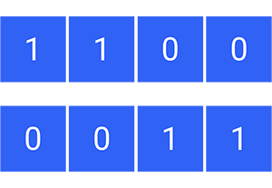

Durante gli anni trascorsi all’università mi sono appassionato alle tematiche relative all’Intelligenza Artificiale e una più di tutte mi ha colpito in maggior modo.

Sto parlando degli algoritmi evolutivi che, a differenza delle altre tipiche tecniche di apprendimento automatico, sono in grado di imparare **senza l'ausilio di un dataset** o, più in generale, senza conoscere le regole sottostanti al problema da risolvere.

Quello che serve è solo la **struttura delle soluzioni** che ammette il problema e una **funzione** che indichi quanto una soluzione sia buona.

Come potrai intuire dal nome essi sfruttano le nozioni della teoria dell’evoluzione con lo scopo di valutare, selezionare e creare nuove soluzioni al problema.

Il loro campo di applicazione è diverso da quello delle altre tecniche e tipicamente vengono utilizzati per risolvere **problemi di ottimizzazione** computazionalmente difficili.

L’assenza di un dataset e l’utilizzo dei principi della teoria dell’evoluzione sono i motivi per cui reputo gli algoritmi evolutivi la forma più “naturale” di apprendimento automatico e ho deciso di scrivere questo articolo con lo scopo di introdurti le principali nozioni del loro funzionamento in modo semplice e chiaro.

## Introduzione

In Intelligenza Artificiale, un **Algoritmo Evolutivo** (EA, da Evolutionary Algorithm) è un sottoinsieme della computazione evolutiva, un algoritmo generico di **ottimizzazione** basato su popolazioni di individui, dove ogni individuo rappresenta una soluzione al problema, e che sfrutta i principi della teoria dell'evoluzione per generare nuovi individui (soluzioni) e selezionare quelli più performanti.

Banalmente, un **problema di ottimizzazione** è un problema decisionale in cui l'obiettivo finale consiste nella massimizzazione (o nella minimizzazione) di una variabile.

Nello sviluppo di un EA generalmente non viene effettuata nessuna assunzione sullo spazio delle soluzioni e questo gli permette di ottenere buoni risultati nell'approssimazione delle soluzioni di numerose tipologie di problemi.

Tuttavia, l'esplorazione di uno spazio di soluzioni molto ampio non è certamente priva di
difficoltà. Infatti, uno dei principali fattori proibitivi degli EA è la complessità computazionale,
dovuta maggiormente al calcolo della **funzione di fitness**. 

Per ovviare a questo problema si può fare affidamento su una tecnica di approssimazione della funzione di fitness.

### Teoria dell'evoluzione

> In natura sopravvivono solo gli individui che sono stati in grado di adattarsi all’ambiente.
>
> Essi, quando si riproducono, danno vita a nuove generazioni a cui passano i loro geni.
>
> Le nuove generazioni hanno quindi una buona possibilità di sopravvivere poiché hanno ereditato le caratteristiche dai loro genitori ed hanno la possibilità di svilupparne di nuove.

Un algoritmo evolutivo utilizza meccanismi ispirati dalla **teoria dell’evoluzione di Darwin**, come riproduzione, mutazione, ricombinazione e selezione per generare delle nuove soluzioni al problema.

Tutti questi principi vengono utilizzati negli algoritmi evolutivi:

- Le possibili soluzioni giocano il ruolo degli **individui** in una **popolazione**
- La **funzione di fitness** determina la **qualità** delle soluzioni.
- L’evoluzione della popolazione avviene applicando gli operatori citati sopra: riproduzione, mutazione, ricombinazione e selezione, che vedremo nello specifico più avanti.

## Elementi

Tutti gli elementi necessari per gli algoritmi evolutivi hanno origine dalla teoria dell’evoluzione di Darwin.

### Individuo

Ogni individuo rappresenta una soluzione al problema.

Spesso l’individuo è denominato **genoma** perché codificato con una sequenza di **geni**, come per il DNA.

L’insieme degli individui presenti in una iterazione dell’algoritmo costituisce la **popolazione** (o **generazione**)

### Funzione di fitness

La funzione di fitness è la funzione che indica la bontà di una soluzione e quindi la qualità di un individuo.

Solitamente corrisponde alla funzione che l’algoritmo sta cercando di ottimizzare.

### Selezione

È il processo che si occupa di decidere quali individui possono passare alla generazione successiva e quali no.

Spesso per effettuarla gli individui vengono ordinati in base al loro **punteggio di fitness**
e poi viene selezionata solo una percentuale di essi con punteggio più alto.

### Crossover

È il corrispettivo della riproduzione in natura.

Dati due individui **il crossover genera 2 nuovi individui** che avranno i geni dei due genitori, combinati in qualche modo.

Il crossover ha varie implementazioni ma ti descriverò quella più comune.

Il processo è molto semplice:

- Viene selezionato un punto di crossover (che può essere scelto a caso ogni volta oppure essere fisso);
- Il primo dei due nuovi individui avrà come geni quelli del primo genitore, fino al punto di crossover, e poi quelli del secondo genitore come restanti;
- Il secondo nuovo individuo sarà composto dai geni del secondo genitore, fino al punto di crossover, e poi da quelli del primo genitore.

Vediamo un **esempio** per chiarire il concetto.

#### Esempio di crossover

Supponiamo di avere dei genomi formati da 4 geni, ognuno
dei quali può assumere un valore binario.

Il primo dei due genitori è costituito da soli 1 e il secondo da soli 0.
Il **punto di crossover** selezionato (indicato con una linea arancione) corrisponde alla metà del genoma.

I nuovi individui saranno quindi composti come segue:

- Il primo avrà tutti 1 fino al punto di crossover, e poi tutti 0;
- Il secondo avrà tutti 0 fino al punto di crossover, e poi tutti 1.

Ecco il risultato:

### Mutazione

La mutazione permette all’algoritmo di poter cercare all’interno di tutto lo spazio delle soluzioni.

Il suo funzionamento è molto semplice: dato un genoma viene scelto a caso un suo gene e gli viene associato un valore casuale (scelto tra i suoi possibili valori).

Solitamente viene applicata subito dopo che l'individuo è stato generato, ma non tutti gli individui la subiscono.
Infatti in un EA viene impostata una **probabilità di mutazione** (generalmente molto bassa, negli ordini del centesimo di percentuale): se il nuovo individuo viene "sorteggiato" allora
viene mutato, altrimenti no.

Vediamo un **esempio**.

#### Esempio di mutazione

Seguendo l'esempio utilizzato per il crossover, utilizziamo i due individui
appena generati e supponiamo che per il nostro EA abbiamo impostato
una probabilità di mutazione dello **0.03%**.

Ora per ogni individuo l'EA dovrà generare un **numero reale casuale da 0 a 1** per decidere
se applicare o meno una mutazione: se il numero risulta minore della probabilità di mutazione allora verrà applicata.

Iniziamo con il primo individuo:

L'EA genera il numero casuale e il risultato è **0.74**, chiaramente maggiore di 0.03 (il nostro fattore di mutazione),
quindi il primo individuo **non subirà alcuna mutazione**.

Passiamo al secondo:

L'EA genera il numero casuale e il risultato è **0.02** che, essendo minore del fattore di mutazione,
fa sì che il secondo individuo **subisca una mutazione**.

A questo punto viene scelto casualmente uno dei suoi geni per essere mutato.
In questo caso è stato sorteggiato l'ultimo (indicato in arancione).

Non resta che assegnare al gene selezionato per la mutazione un valore casuale tra quelli possibili,
ed ecco il risultato della mutazione:

## Processo

Vediamo qual'è il processo che segue un algoritmo evolutivo, dall'inizio fino alla sua terminazione:

1. Il processo dell’algoritmo inizia con la creazione di una popolazione di individui iniziale, generalmente create in modo randomico (prima generazione);

2. Viene valutato il fitness degli individui della generazione;

3. Vengono selezionati i migliori individui della generazione;

4. I migliori individui vengono utilizzati per generarne di nuovi, utilizzando il crossover e la mutazione;

5. I nuovi individui sostituiscono quelli che hanno un fitness più basso (dando vita alla nuova generazione).

Gli step 2-5 vengono ripetuti fino alla condizione di terminazione che può essere ad esempio:

- Massimo tempo trascorso;
- Massimo numero di generazioni raggiunto;
- Le nuove generazioni non migliorano il massimo fitness in maniera significativa.

L'output dell'algoritmo non è altro che l'individuo con punteggio di fitness più alto
dell'ultima generazione.

Esso infatti rappresenta la miglior soluzione che l'algoritmo evolutivo ha trovato durante
la sua esecuzione.

## Quando utilizzarli

Come ti ho già accennato, gli algoritmi evolutivi sono degli algoritmi utilizzati per risolvere problemi di
ottimizzazione.

Non necessitano di un dataset e godono di molta libertà dal punto di vista dello "spaziare" alla ricerca
delle soluzioni.

Questa libertà di muoversi senza aver alcuna assunzione sul problema sottostante
non deve farti pensare che possano risolvere qualsiasi problema gli venga sottoposto.

Se applicati in modo errato non restituiranno una soluzione nemmeno vicina alla più pessima approssimazione.

> **True story**
>
> Una volta ho realizzato un algoritmo evolutivo per generare delle immagini di dimensione 512x512
> che dovevano essere **simili** ad altre.
> Dopo ore e ore di training avevo ancora solo un mucchio di pixel senza senso sullo schermo.

Per evitare di commettere gli **errori più comuni**, prima di applicare un algoritmo evolutivo assicurati di:

- Aver determinato il problema da risolvere e l'obiettivo da raggiungere;
- Aver trovato la rappresentazione giusta di una soluzione al problema (sotto forma di genoma);
- Aver trovato un modo chiaro per valutare la bontà di una soluzione;
- Avere una funzione di valutazione non troppo dispendiosa (dal punto di vista del calcolo).

Inoltre tieni in considerazione anche i seguenti punti:

- Hanno una natura non deterministica. Questo implica il fatto che le loro soluzioni possano variare anche fornendo la stessa istanza iniziale;
- Il tempo impiegato per convergere può essere molto lungo;
- Le soluzioni restituite possono essere dei minimi/massimi locali;
- La qualità delle soluzioni varia in base ad alcuni fattori, tra cui:
  1. La popolazione iniziale;
  2. L’implementazione degli operatori genetici;
  3. Le probabilità di crossover e mutazione.

Immagino che tu ora stia pensando: *Ma allora quando posso utilizzarli?*

Hai ragione, ma sto per darti una dritta:

> In generale gli algoritmi evolutivi sono ottimi per trovare delle **buone soluzioni** in breve tempo
> piuttosto che trovare le **soluzioni ottime** al problema.

## Tipologie

Tecniche simili degli algoritmi evolutivi differiscono per rappresentazioni genetiche e altri dettagli di implementazione oltre che alla natura del particolare problema a cui sono applicate.

Eccone alcune tra le più conosciute.

### Algoritmi Genetici

È la tipologia più popolare di EA. Ricerca la soluzione di un problema nella forma di stringhe di numeri (solitamente binari) applicando crossover e/o mutazione.

### Programmazione genetica

Qui le soluzioni sono nella forma di programmi per computer e il loro fitness è valutato in base alla capacità di risolvere un problema computazionale.

### Programmazione evolutiva

Simile alla programmazione genetica ma la struttura del software è fissata e solo i parametri numerici possono evolvere.

### Neuroevoluzione

In questo caso i genomi rappresentano reti neurali artificiali descrivendo struttura e pesi delle connessioni.

## Conclusioni

In questo articolo hai appreso le basi e i principi del funzionamento degli algoritmi evolutivi.

Avrai anche capito che non è possibile applicarli in tutti i tipi di problemi ma sappi che
quando vengono applicati in modo corretto allora possono performare molto meglio di altre tecniche.

Non sempre sono lo strumento adatto per ricercare soluzioni ma sono sicuramente molto interessanti
e **assolutamente divertenti**.

Ti lascio con un esempio su come sono stati applicati in un programma che genera forme con due ruote
cercando quale di esse è la migliore per correre su un tracciato in 2D (per apprezzarlo al meglio
ti consiglio di vederlo da Desktop).

<a title="Esempio Algoritmi Evolutivi" href="https://rednuht.org/genetic_cars_2/" target="_blank" rel="noopener noreferrer">Esempio Algoritmi Evolutivi</a>.
